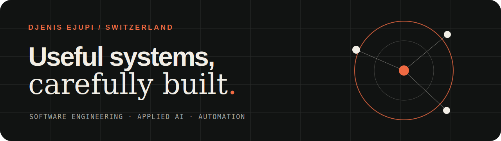
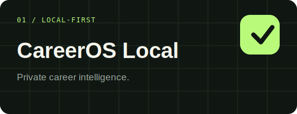
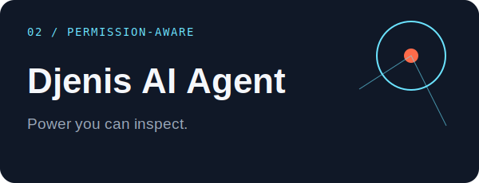
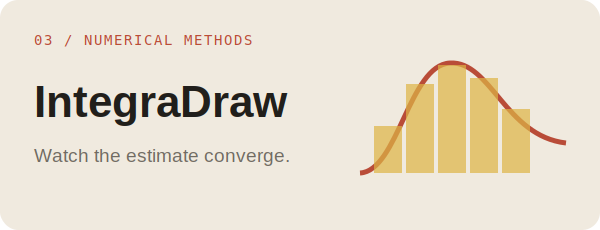
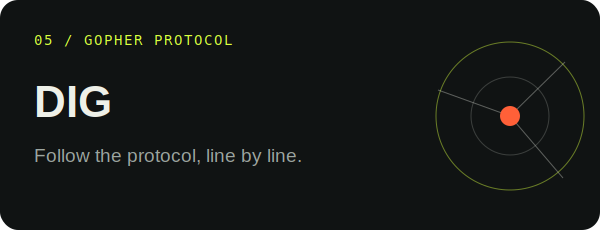

  

  <a href="https://ejupilabs.com">Portfolio</a> ·
  <a href="https://www.linkedin.com/in/djenis-ejupi">LinkedIn</a> ·
  <a href="mailto:djenis.ejupi@ejupilabs.com">Email</a>

Switzerland · English / Italian / Albanian

I build software in Switzerland. My work sits between backend engineering, applied AI, automation and product design. I care about the unglamorous parts too: clear boundaries, useful tests, safe defaults and interfaces people can understand without a manual.

### Selected work

<table>
  <tr>
    <td width="50%">
      
       Private career intelligence that stays on the device.
    </td>
    <td width="50%">
      
       A permission-aware desktop agent with an inspectable control plane.
    </td>
  </tr>
  <tr>
    <td width="50%">
      
       See numerical integration converge, rectangle by rectangle.
    </td>
    <td width="50%">
      
       A real Gopher client and an honest browser-based protocol explorer.
    </td>
  </tr>
  <tr>
    <td colspan="2">
      
       A local dialogue experiment that shows the rule behind every reply.
    </td>
  </tr>
</table>

### The toolkit

`Python` `Rust` `Java` `TypeScript` `React` `Node.js` `FastAPI` `Cloudflare` `Docker` `GitHub Actions`

I choose tools after I understand the constraint. Sometimes that means a Rust core. Sometimes it means plain JavaScript with no build step. The repository should make that decision easy to inspect.

### Working notes

- I am currently tightening the boundary between powerful AI tooling and explicit user permission.
- Public demos use synthetic fixtures when real data would be inappropriate.
- Older collaborative projects keep their original contributors in the history and documentation.

  <a href="https://ejupilabs.com"><strong>See the work at ejupilabs.com →</strong></a>

