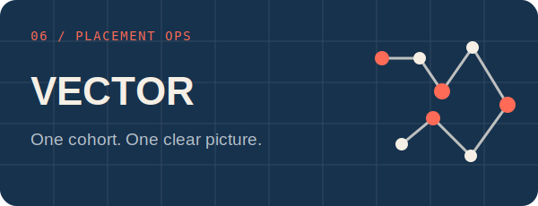

  

  <a href="https://ejupilabs.com">Portfolio</a> ·
  <a href="https://www.linkedin.com/in/djenis-ejupi">LinkedIn</a> ·
  <a href="mailto:info@ejupilabs.com">Email</a>

Switzerland · English / Italian / Albanian

I build software in Switzerland, usually where backend engineering, applied ML, automation and product design meet. I like ambitious systems, but I care just as much about the parts nobody puts in a screenshot: clear boundaries, useful tests, safe failure modes and interfaces that explain themselves.

### Systems you can run

<table>
  <tr>
    <td width="50%">
      
       Verified career records, deterministic job search, application timelines and reproducible dossiers. Private career data stays local.
    </td>
    <td width="50%">
      
       An open-set ML lab with isolated data splits, calibration, abstention and verifiable model artifacts.
    </td>
  </tr>
  <tr>
    <td width="50%">
      
       A permission-gated desktop agent whose actions remain visible and inspectable.
    </td>
    <td width="50%">
      
       See numerical integration converge, rectangle by rectangle.
    </td>
  </tr>
  <tr>
    <td width="50%">
      
       A real Gopher client and an honest browser-based protocol explorer.
    </td>
    <td width="50%">
      
       A clear, local operations board for an entire placement cohort.
    </td>
  </tr>
</table>

<table>
  <tr>
    <td width="33%"><strong>Useful first</strong> I start with the decision or task the software needs to improve.</td>
    <td width="33%"><strong>Evidence over claims</strong> Tests, fixtures, release artifacts and limitations stay visible in the repository.</td>
    <td width="33%"><strong>Built to run</strong> Deployment, recovery, privacy and maintenance are part of the design.</td>
  </tr>
</table>

### The toolkit

`Python` `Rust` `Java` `TypeScript` `React` `Node.js` `FastAPI` `Cloudflare` `Docker` `GitHub Actions`

I choose tools after I understand the constraint. Sometimes that means a Rust core. Sometimes plain JavaScript is the better answer. The repository should make the trade-off easy to inspect.

### Working notes

- I am building ML and automation tools that know when to stop, abstain or ask for permission.
- Public demos use synthetic fixtures when real data would be inappropriate.
- Shared work is acknowledged without turning contributor identities into product copy.

  <a href="https://ejupilabs.com"><strong>See the work at ejupilabs.com →</strong></a>

