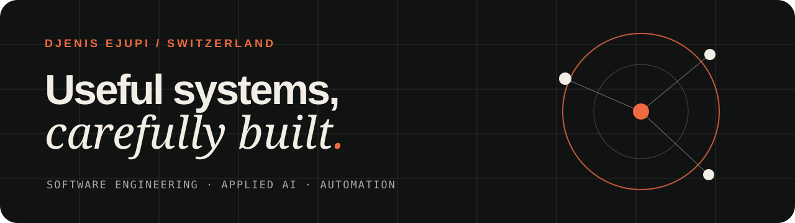
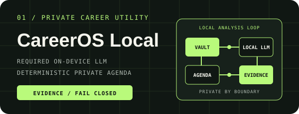
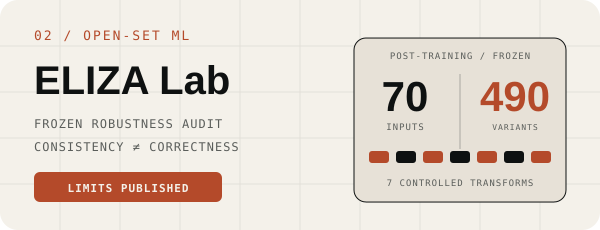
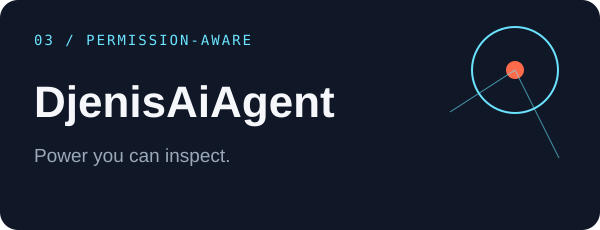
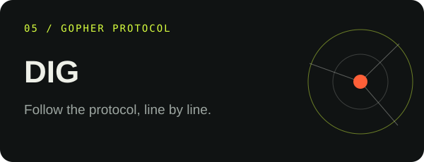
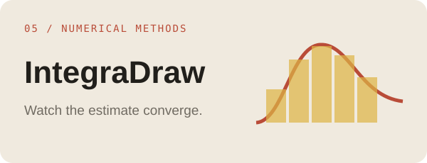
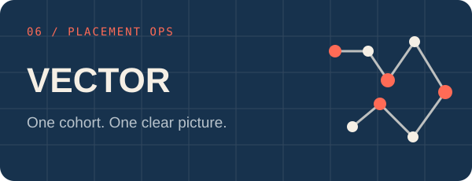
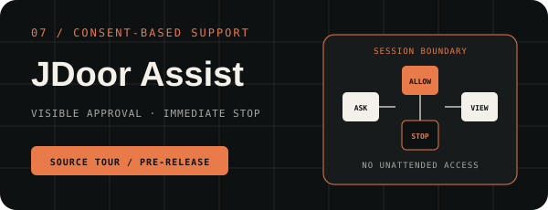

  

  <a href="https://djenis.ejupilabs.com">Portfolio</a> ·
  <a href="https://ejupilabs.com">Ejupi Labs</a> ·
  <a href="https://www.linkedin.com/in/djenis-ejupi">LinkedIn</a> ·
  <a href="mailto:djenis.ejupi@ejupilabs.com">Email</a>

Switzerland · English / Italian / Albanian

I’m a product-minded software engineer and founder of Ejupi Labs, based in Switzerland. I build dependable software where backend engineering, applied ML, automation and product design meet—especially when permissions, failure modes and operational clarity matter.

I was born on 30 March 2003 in a small village in Macedonia and spent most of my childhood and adolescence in Italy.

### Selected systems

**CareerOS Local `v1.8.0`** is a local-first career utility that turns verified experience into resumes, relevant opportunities and an application workflow. Its Career Vault preserves source facts and revision history; search analysis uses an approved on-device model with no cloud fallback.

[Open the product page](https://ejupi-djenis30.github.io/careeros-local/) · [Review the v1.8.0 release](https://github.com/ejupi-djenis30/careeros-local/releases/tag/v1.8.0)

 

**ELIZA Lab `v1.5.0`** is an educational open-set ML pipeline and browser lab. Its frozen robustness audit applies seven controlled transformations to 70 ID-test inputs, producing 490 variants. The fixtures are synthetic and English-only, and consistency does not prove correctness.

[Open the ML lab](https://ejupi-djenis30.github.io/eliza-lab/) · [Review the v1.5.0 release](https://github.com/ejupi-djenis30/eliza-lab/releases/tag/v1.5.0)

 

**DjenisAiAgent `v0.2.2`** takes one observable action at a time. It separates `observe`, `interact` and `system` permissions, restricts paths, applications and commands with allowlists, and requires a fresh observation before marking work complete.

[Open the agent project](https://ejupi-djenis30.github.io/DjenisAiAgent/) · [Review the v0.2.2 release](https://github.com/ejupi-djenis30/DjenisAiAgent/releases/tag/v0.2.2)

 

**DIG `v3.0.0`** is a bounded Gopher client with a CLI, local web inspector and same-origin gateway. The command line opens real `gopher://` resources; the public page uses a committed fixture, while the local gateway gives the same interface bounded TCP access.

[Open the protocol explorer](https://ejupi-djenis30.github.io/Dig/) · [Review the v3.0.0 release](https://github.com/ejupi-djenis30/Dig/releases/tag/v3.0.0)

 

**IntegraDraw `v1.1.2`** compares midpoint and trapezoidal integration with a Simpson reference you can see. Its Java desktop app and TypeScript Canvas workbench consume the same golden numerical corpus, so a visual change cannot quietly change the maths.

[Open the workbench](https://ejupi-djenis30.github.io/IntegraDraw/) · [Review the v1.1.2 release](https://github.com/ejupi-djenis30/IntegraDraw/releases/tag/v1.1.2)

 

**VECTOR `v3.0.0`** is a self-hosted, multi-user placement operations platform. Scoped roles, persistent SQLite records, completion controls and append-only audit events keep one school’s workflow inspectable; release builds are compared across Ubuntu and Windows before publication.

[Open the product tour](https://ejupi-djenis30.github.io/vector-placement-operations/) · [Review the v3.0.0 release](https://github.com/ejupi-djenis30/vector-placement-operations/releases/tag/v3.0.0)

 

**JDoor Assist** documents a consent-based modernization of a collaborative school project. The public tour makes approval, session limits, stop conditions and shared source history explicit. No public release is claimed while distribution remains in preparation.

[Visit the JDoor Assist website](https://ejupi-djenis30.github.io/JDoor/) · [Inspect the shared source history](https://github.com/ejupi-djenis30/JDoor)

### Engineering principles

- **Useful first.** I start with the decision or task the software needs to improve.
- **Evidence over claims.** Tests, fixtures, release artifacts and limitations stay visible in the repository.
- **Bounded by design.** Permissions, privacy, recovery and stop conditions are part of the product.

### Toolkit

`Python` `Rust` `Java` `TypeScript` `React` `Node.js` `FastAPI` `Cloudflare` `Docker` `GitHub Actions`

I choose tools after the constraint is clear. Sometimes that calls for a Rust core; sometimes plain JavaScript is the more responsible answer. The repository should make the trade-off easy to inspect.

### Current focus

I’m currently focused on local-first workflows and high-agency software that can abstain, fail closed or ask for permission before it acts.

  <a href="https://djenis.ejupilabs.com"><strong>Visit my personal portfolio →</strong></a> ·
  <a href="https://ejupilabs.com">Explore Ejupi Labs ↗</a>

